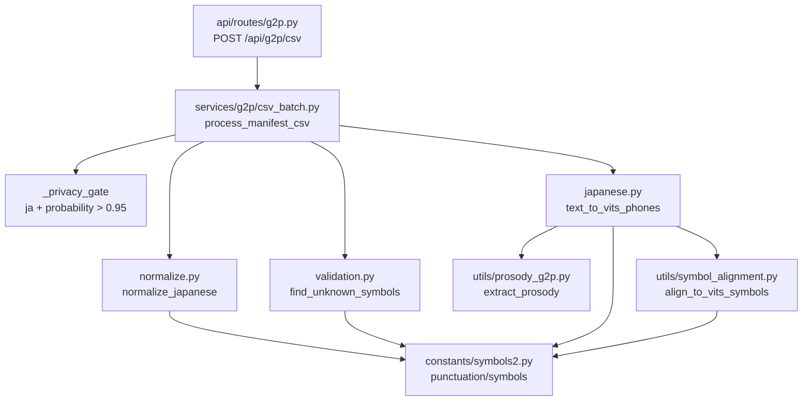

# G2P 模块说明（`services/g2p`）

本目录负责把日语文本/manifest CSV 转成 GPT-SoVITS 可用的音素序列。

核心流水线：

1. 隐私过滤（仅 `ja` + `probability > 0.95`）
2. 文本规范化
3. 日语 G2P（标点切分与缝合）
4. 音素对齐到 `symbols2` 词表
5. 词表校验与 CSV 产出

---

## 文件树地图（eza）

以下来自本地命令：
`eza --tree --level 3 --group-directories-first --icons=never src/nlp_server/services/g2p`

```text
src/nlp_server/services/g2p
├── constants
│   └── symbols2.py
├── utils
│   ├── prosody_g2p.py
│   └── symbol_alignment.py
├── csv_batch.py
├── japanese.py
├── normalize.py
├── README.md
└── validation.py
```

---

## 文件职责与 IO 契约

### `csv_batch.py`（批处理编排层）

- **职责**：读取 CSV 文本，逐行执行隐私过滤 + G2P，输出“保留原列 + 新增列”的 CSV。
- **公开函数**：
  - `process_manifest_csv(csv_text: str) -> str`
    - **输入**：UTF-8 CSV 字符串（必须有 header）
    - **输出**：处理后的 CSV 字符串
    - **异常**：无 header 时抛 `ValueError("CSV has no header")`
    - **边界行为**：
      - 自动追加缺失 G2P 列：`norm_text,phones,phone_count,word2ph,status,error`
      - 行级错误不会抛异常，而是写 `status=error`
  - `summarize_manifest_csv(csv_text: str) -> dict[str, int]`
    - **输入**：含 `status` 列的 CSV 文本
    - **输出**：`{"ok":x,"skip":y,"error":z,"total":n}`

- **内部行级契约（由 `_process_row` 实现）**：
  - `status=skip`
    - `privacy_language_not_allowed`
    - `privacy_probability_too_low`
    - `empty_text`
  - `status=ok`
    - 填充 `norm_text`, `phones`（空格分隔）, `phone_count`, `word2ph="None"`
  - `status=error`
    - 词表外符号：`unknown: [...]`
    - 或下游异常字符串

---

### `japanese.py`（日语文本 -> 音素）

- **职责**：实现 GPT-SoVITS 风格的“标点切分-缝合”日语 G2P。
- **公开对象**：
  - `text_to_vits_phones(text: str) -> list[str]`
    - **输入**：任意文本（内部先 `lower()`）
    - **输出**：对齐后的音素列表（已执行 `align_to_vits_symbols`）
    - **关键行为**：
      - 正则分离文本片段与标点
      - 文本片段调用 `extract_prosody`
      - 标点按原顺序缝回
  - `get_japanese_text_input(text: str) -> JapaneseTextInput`
    - **输入**：文本
    - **输出**：`{"text": str, "phones": list[str], "phone_ids": list[int]}`
    - **边界行为**：遇到未知符号只打印 warning，跳过该 symbol 的 id
  - `JapaneseTextInput`（TypedDict）
    - 字段：`text`, `phones`, `phone_ids`

---

### `normalize.py`（规范化）

- **职责**：最小文本规范化。
- **公开函数**：
  - `normalize_japanese(text: str) -> str`
    - **输入**：原始文本
    - **输出**：去重连续标点后的文本
    - **规则来源**：使用 `symbols2.punctuation` 构建正则去重

---

### `validation.py`（词表校验）

- **职责**：检查音素是否在 `symbols2.symbols` 词表内。
- **公开函数**：
  - `find_unknown_symbols(phones: list[str]) -> list[str]`
    - **输入**：音素列表
    - **输出**：词表外音素列表（为空表示全合法）

---

### `utils/prosody_g2p.py`（韵律提取）

- **职责**：基于 `pyopenjtalk-plus` 提取音素 + 韵律符号（ESPnet 规则）。
- **公开函数**：
  - `extract_prosody(text: str, drop_unvoiced_vowels: bool = True) -> list[str]`
    - **输入**：日语文本
    - **输出**：原始序列，例如 `['^', 'k', 'o', '[', ..., '$']`
    - **边界行为**：
      - `sil` 转句首/句尾边界：`^`, `$`, `?`
      - `pau` 转 `_`
      - 可能插入韵律符号：`#`, `[`, `]`

---

### `utils/symbol_alignment.py`（符号对齐）

- **职责**：把原始音素序列映射为 `symbols2.py` 兼容序列。
- **公开函数**：
  - `align_to_vits_symbols(phones: list) -> list`
    - **输入**：原始音素列表
    - **输出**：对齐后的列表
    - **规则**：
      - 标点映射：`。 -> .`, `！ -> !`, `、 -> ,` 等
      - 剔除：`^`, `$`, `#`
      - 保留 `_`（pause）

---

### `constants/symbols2.py`（词表常量）

- **职责**：保存 GPT-SoVITS 绑定词表常量（禁止改动内容）。
- **主要导出**：
  - `punctuation`, `pu_symbols`, `pad`
  - `c`, `v`, `v_without_tone`, `ja_symbols`, `arpa`, `ko_symbols`, `yue_symbols`
  - `symbols`（最终全局词表）
- **IO 契约**：无函数 IO；被其它模块当作只读数据源。

---

## 模块调用关系（Mermaid）



---

## 目录外强耦合（补充）

这些文件不在 `services/g2p` 下，但与本模块 IO 契约强绑定：

- `src/nlp_server/schemas/g2p.py`
  - 定义 `INPUT_COLUMNS`, `G2P_COLUMNS`, `OUTPUT_COLUMNS`
  - 定义隐私常量：`PRIVACY_ALLOWED_LANGUAGE = "ja"`、`PRIVACY_MIN_PROBABILITY = 0.95`
- `src/nlp_server/api/routes/g2p.py`
  - HTTP 入口，读取上传 CSV，调用 `process_manifest_csv`
- `src/nlp_server/api/router.py`
  - 将 g2p 路由挂载到 `/api`
- `scripts/test_g2p_csv.py`
  - 手工验证 CSV 处理与统计
- `scripts/test_g2p_prosody.py`
  - 手工验证 prosody/alignment/pipeline 行为

---

## 当前已知边界与注意事项

- `probability == 0.95` 会被 `skip`（条件是 `<= 0.95`）。
- 输入 CSV 未强制校验必须含哪些列；缺列会导致行级 `skip/error`，不会提前失败。
- `word2ph` 当前固定为字符串 `"None"`（不是 Python `None`）。
- `get_japanese_text_input` 会对未知符号“告警并跳过 id”，而 `csv_batch.py` 则会写 `status=error`；两者容错策略不同。
- `symbols2.py` 内容与模型绑定，原则上只读。
